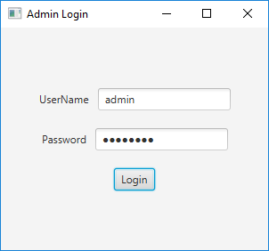
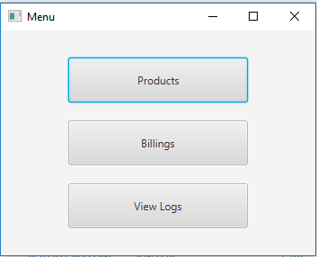
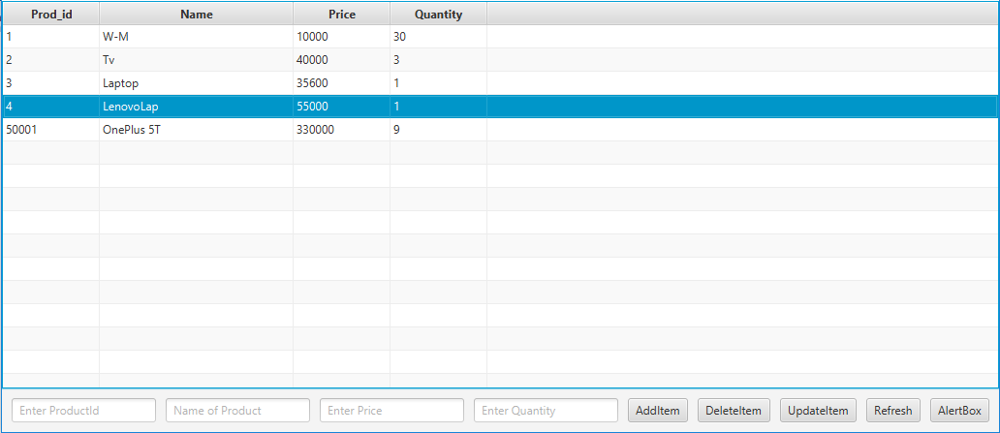
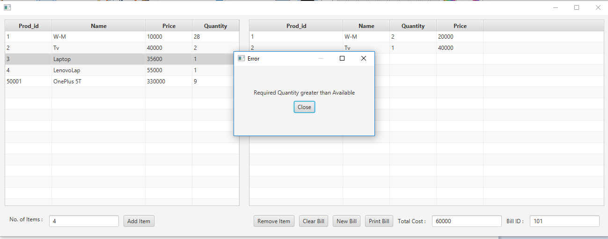
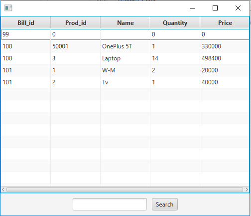
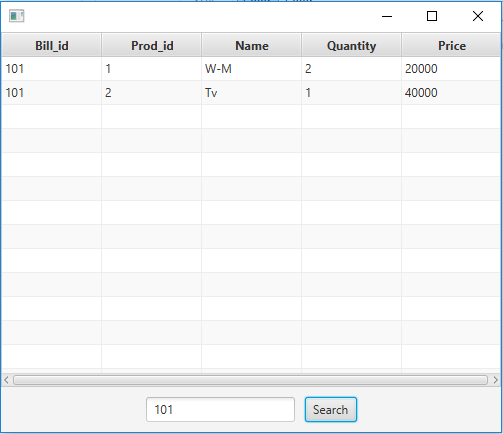

# Inventory-Management-System
* This System helps to manage Inventory of any Shop.
* It provides User of the System with several options like add, delete, view and edit Information of the product.
* The System has a simple to use GUI. 
* Inventory is connected with a billing System.
* So whenever a bill is made, All the products from inventory automatically get deducted.
* Also it warns the user if any of the product's quantity is below threshold value.

